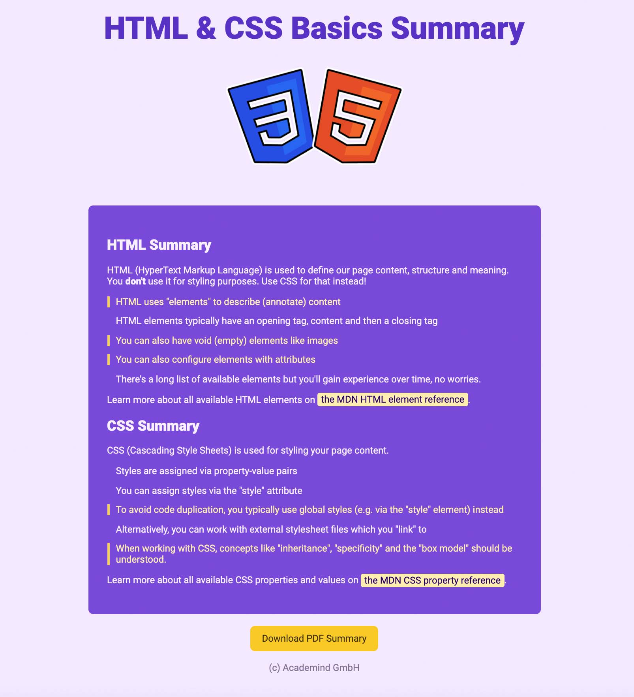
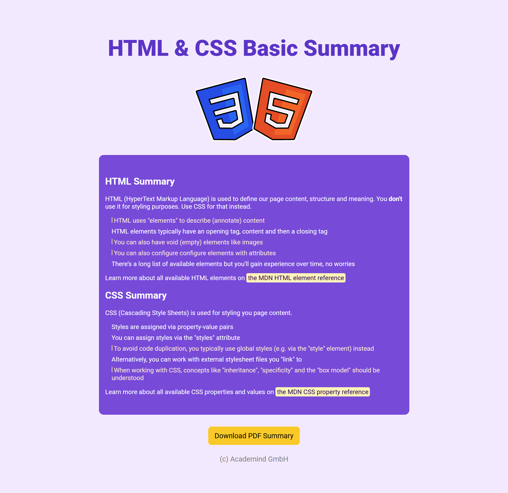

---

## How I Built the Website

### 1. **HTML Structure**
I started by analyzing the provided design and breaking it down into semantic HTML elements. Here’s how I structured the HTML:

- **Header Section**: Contains the navigation bar and hero section.
- **Main Content**: Includes sections for features, testimonials, and calls to action.
- **Footer**: Contains links, social media icons, and copyright information.

I used semantic tags like `<header>`, `<main>`, `<section>`, and `<footer>` to ensure the website is accessible and well-structured.

### 2. **CSS Styling**
To replicate the design, I used CSS for styling and layout. Here are the key CSS concepts I applied:

- **Flexbox**: Used for creating flexible and responsive layouts, especially for the navigation bar and feature sections.
- **Grid**: Implemented CSS Grid for more complex layouts, such as the testimonial section.
- **Media Queries**: Added responsive design by using media queries to adjust the layout for different screen sizes.
- **Custom Fonts**: Integrated custom fonts using `@font-face` and Google Fonts.
- **Box Model**: Utilized padding, margin, and border properties to space elements correctly.
- **Transitions and Hover Effects**: Added subtle hover effects to buttons and links for better user interaction.

### 3. **Images and Icons**
I included images and icons to match the design. These were placed in the `./images/` folder and linked in the HTML and CSS files.

### 4. **Responsive Design**
The website is fully responsive and adapts to different screen sizes. I used media queries to adjust the layout, font sizes, and image dimensions for mobile, tablet, and desktop views.

---

## Core Concepts Applied

This project helped me practice and apply the following core concepts of HTML and CSS:

### HTML:
- Semantic HTML tags (`<header>`, `<main>`, `<section>`, `<footer>`, etc.)
- Image embedding (``)
- Links and navigation (`<a>`, `<nav>`)
- Lists (`<ul>`, `<li>`)
- Forms and buttons (`<form>`, `<input>`, `<button>`)

### CSS:
- Box model (margin, padding, border)
- Flexbox and Grid for layout
- Media queries for responsiveness
- Custom fonts and typography
- Pseudo-classes (`:hover`, `:focus`)
- Transitions and animations

---

## Final Output

Here’s a comparison of the original design and my final output:

### Original Design (`expected-website.png`)


### My Final Output (`my-website-final-output.png`)


---

## How to Run the Project

1. Clone the repository:
   ```bash
   git clone https://github.com/jarjishSiddibapa/html-css-core-concepts-challenge-website.git
2. Open the index.html file in your browser to view the website.

---

# What I Learned
1. This project was a great learning experience. Here are some key takeaways:

2. The importance of semantic HTML for accessibility and SEO.

3. How to use Flexbox and Grid to create complex layouts.

4. The role of media queries in building responsive designs.

5. The value of breaking down a design into smaller components before coding.

---

# Future Improvements
1. While I’m happy with the outcome, there’s always room for improvement. Some ideas for future enhancements include:

2. Adding more interactivity with JavaScript.

3. Optimizing the website for performance.

4. Improving accessibility with ARIA roles and labels.

---

# Acknowledgments
1. Academind for providing the challenge as part of the 100 Days of Web Development course.
2. My peers and mentors for their feedback and support.

---

Thank you for checking out my project! If you have any feedback or suggestions, feel free to open an issue or reach out to me. 😊
